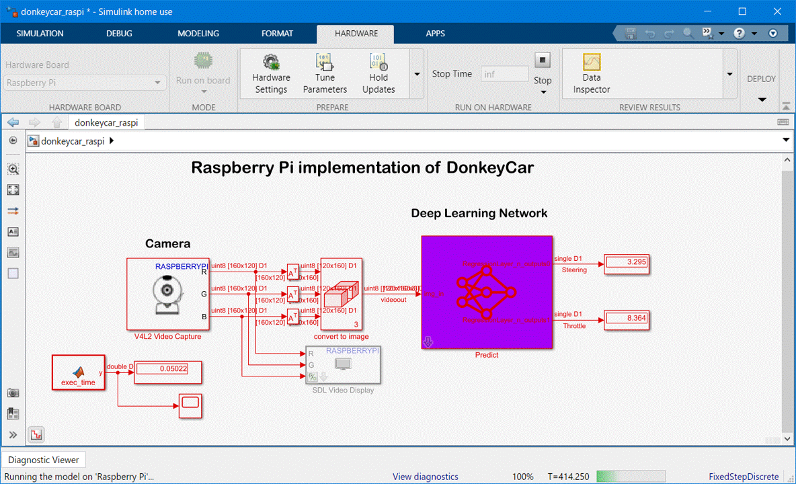

# Implementation of DonkeyCar's deep learning model on RaspberryPi using MATLAB/Simulink

## MATLAB command to download and open the demo 
```
mkdir('./donkeycar_raspi');
cd('./donkeycar_raspi');
websave('donkeycar_raspi.mdl','https://github.com/covao/DonkeyCar_Raspi_Simulink/raw/main/donkeycar_raspi.mdl');
url = 'https://github.com/autorope/donkey_datasets/raw/master/circuit_launch_20210716/';
netfile='pilot_21-08-12_7.h5';
websave(netfile,[url 'models/' netfile]);
donkeyKerasNet = importKerasNetwork(netfile); %Load pre-trained network
save donkeyKerasNet;
open('donkeycar_raspi.mdl');
```

  

